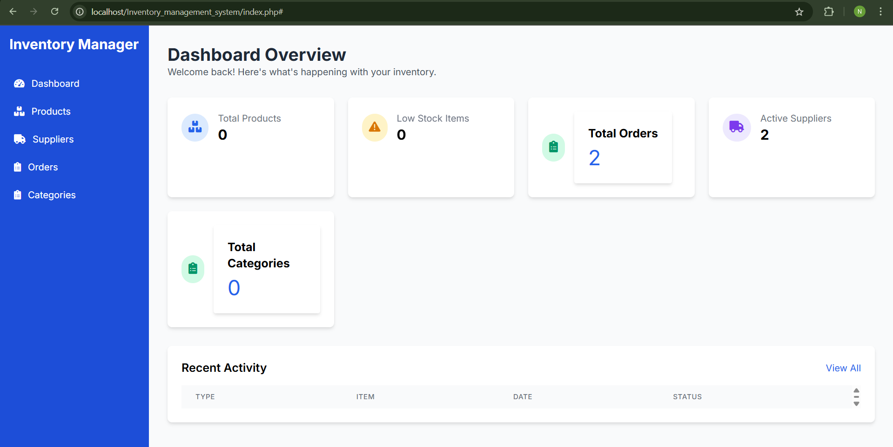
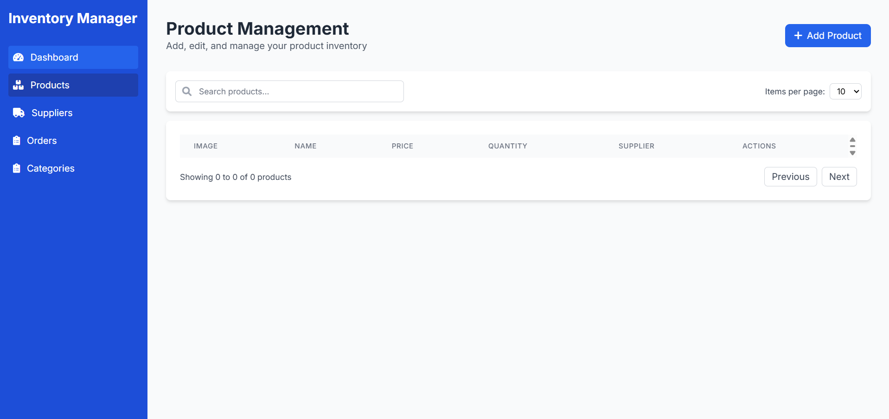
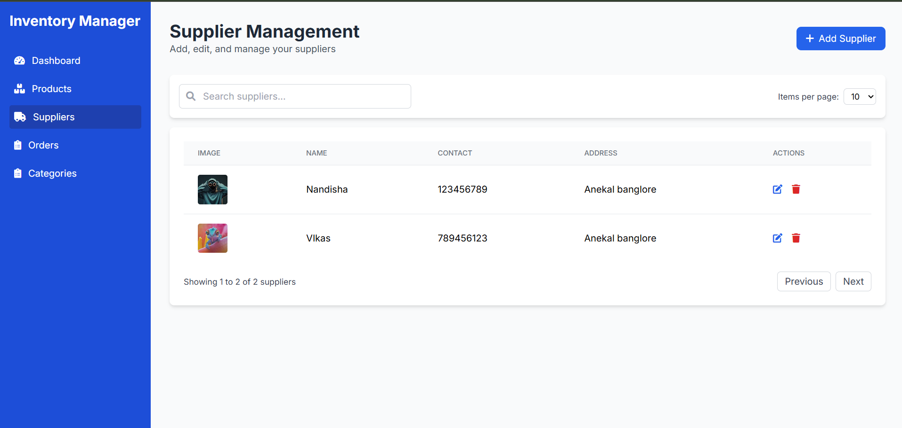
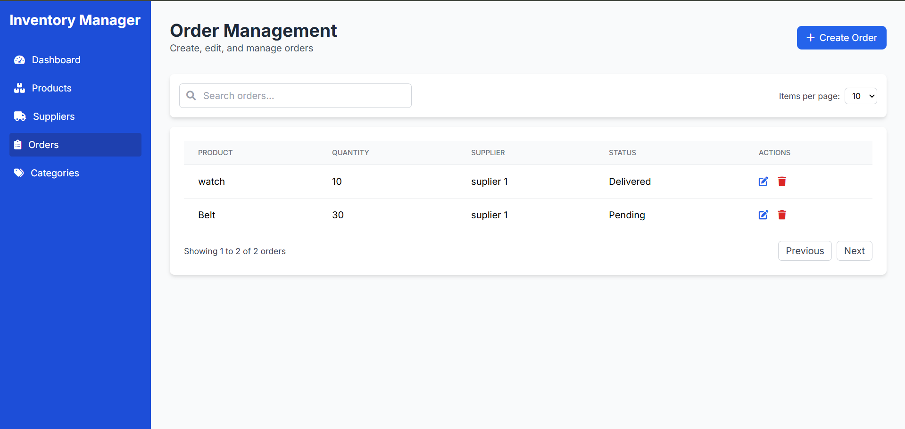
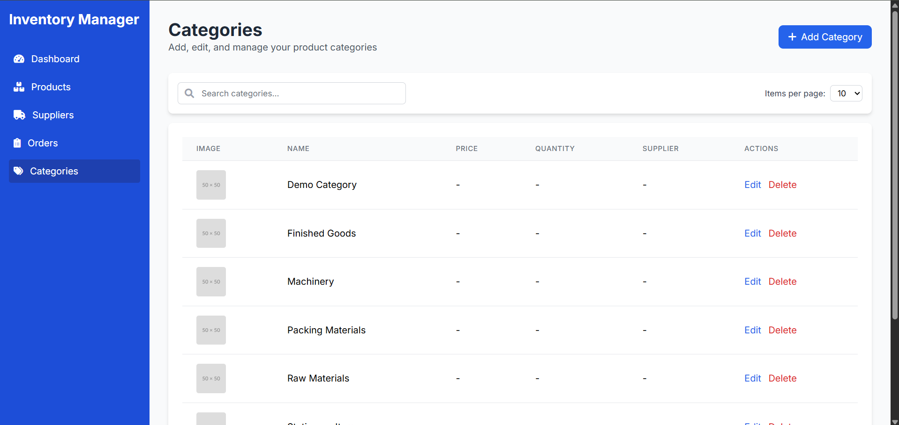
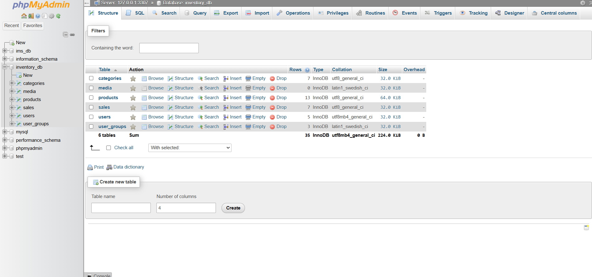

# 📦 Inventary-Management-System-IMS-

A web-based Inventory Management System built using **PHP**, **MySQL**, **JavaScript**, and **Tailwind CSS**. This system helps businesses efficiently manage products, suppliers, orders, and sales, with a clean dashboard interface and full CRUD operations for effective inventory control.

---

## 🚀 Features

- ✅ **User Authentication** (Login / Register)
- 📦 **Product Management** (Add, Edit, Delete, Search, Pagination)
- 🧾 **Order Management** with dynamic status toggling
- 🚚 **Supplier Management** with CRUD and pagination
- 📊 **Sales and Purchase Reports**
- 📁 **File Upload** support for product images
- 🧩 **Modular PHP Codebase** with clean UI using Tailwind CSS
- 📱 **Responsive Design** for optimal use on mobile and desktop

---

## 🛠️ Tech Stack

| Layer        | Technology                 |
|--------------|-----------------------------|
| Frontend     | HTML, Tailwind CSS, JavaScript |
| Backend      | PHP                          |
| Database     | MySQL                        |
| Server       | XAMPP / LAMP / WAMP          |

---

## 📁 Folder Structure

Inventory_management_system/ ├── assets/ # CSS and JS files │ ├── style.css │ └── script.js ├── includes/ # Backend logic │ ├── sql.php │ └── upload.php ├── index.php # Dashboard ├── login.php # Login page ├── register.php # User registration ├── logout.php # Logout logic ├── products.php # Product management UI ├── suppliers.php # Supplier management UI ├── orders.php # Orders management UI ├── categories.php # Category management UI ├── reports.php # Sales and purchase reports ├── purchase_order.php # Purchase order form └── api.php # API for AJAX-based CRUD


---

## 📸 Screenshots

>   
> 
- 
- 
- 
- Data Base Setup
- 

---

## 📦 Setup Instructions

1. **Clone the repository:**
   ```bash
   git clone https://github.com/Nandisha-code/Inventary-Management-System-IMS-.git
   cd Inventary-Management-System-IMS-


## 📦 Setup Instructions

1. **Clone the repository:**
   ```bash
   git clone https://github.com/Nandisha-code/Inventary-Management-System-IMS-.git
   cd Inventary-Management-System-IMS-


   $conn = mysqli_connect("localhost", "root", "", "inventory_db");


    http://localhost/Inventory_management_system/
    


👩‍💻 Developed by
Nandisha Tarlagatti
Computer Science & Engineering Student
🚀 Passionate about Full Stack dvelopment, MLOps, and Open Source